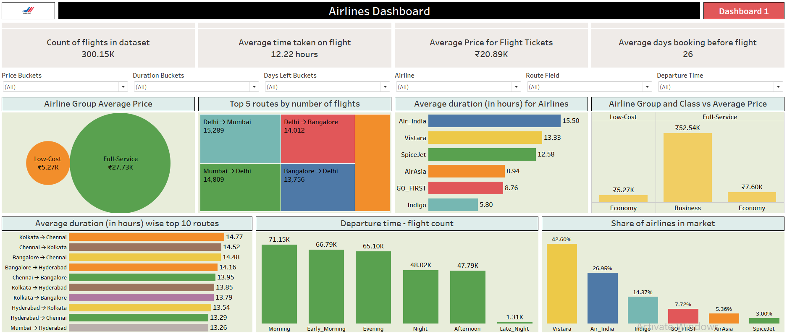
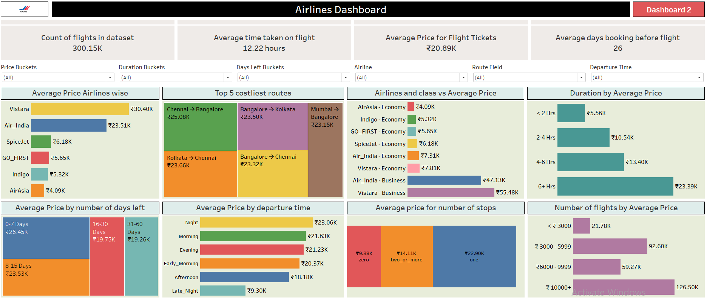

✈️ Airlines Dashboard Project (Tableau)
📌 Project Overview

This project analyzes flight pricing, duration, and booking patterns using a dataset of 300,000+ airline records sourced from Kaggle. The dashboards were created in Tableau to derive insights that are highly relevant for:

Airlines & Travel Companies → understanding market pricing, customer booking behavior, and route demand.

Business Analysts / Data Analysts → exploring data-driven decision-making with interactive dashboards.

Recruiters & Hiring Managers → assessing my ability to work with real-world datasets, create meaningful KPIs, and design interactive dashboards for storytelling.

📊 Dashboards
🔹 Dashboard 1: Market Overview & Trends

This dashboard provides a high-level analysis of airline market behavior.
Key Highlights:

Airline Group Pricing: Full-service airlines charge significantly higher average fares (₹27.73K) compared to low-cost carriers (₹5.27K).

Top Routes by Volume: High-traffic routes include Delhi ↔ Mumbai and Delhi ↔ Bangalore with 15K+ flights.

Flight Duration by Airline: Air India has the longest average flight duration (15.5 hrs) while Indigo operates with the shortest (5.8 hrs).

Airline Market Share: Vistara (42.6%) and Air India (26.9%) dominate the market.

Departure Time Insights: Morning and early-morning flights see the highest number of departures (~70K each).

🔹 Dashboard 2: Price & Booking Behavior

This dashboard focuses on pricing dynamics and customer behavior.
Key Highlights:

Airline-wise Pricing: Vistara (₹30.4K avg) and Air India (₹23.5K avg) are the most expensive.

Costliest Routes: Chennai → Bangalore (₹25K) and Kolkata → Chennai (₹23.6K) rank highest.

Class-based Pricing: Business class (₹47K–₹55K) is ~6–7x more expensive than economy class.

Impact of Booking Days: Last-minute bookings (0–7 days left) average ₹26.4K, while early bookings (31–60 days) average only ₹19.2K.

Duration vs Price: Longer flights (6+ hours) average ~₹23.4K.

Stops vs Pricing: One-stop flights are the costliest (₹22.9K), while direct flights average just ₹9.3K.

🛠️ Tools & Technologies

Dataset: Kaggle Airlines Dataset (~300K records)

Data Visualization: Tableau

Data Preparation: Excel / Tableau built-in data wrangling

KPIs Tracked:

Average flight price

Average flight duration

Booking lead time

Airline market share

Route demand & price segmentation

🎯 Business Insights

Airlines can optimize pricing by monitoring booking patterns (early bookings are cheaper → potential for targeted promotions).

Travel Agencies can recommend the best-value times to fly (night & afternoon flights are cheapest).

Passengers can save significantly by booking at least 30+ days in advance and choosing direct flights.

Airline Strategy Teams can evaluate which routes are premium-priced and require additional capacity or competition.

📌 Key Skills Demonstrated

Data cleaning & preparation for visualization

Advanced Tableau dashboard design (filters, KPIs, interactive visuals)

Storytelling with data → turning raw datasets into business insights

Analytical thinking with real-world applicability
